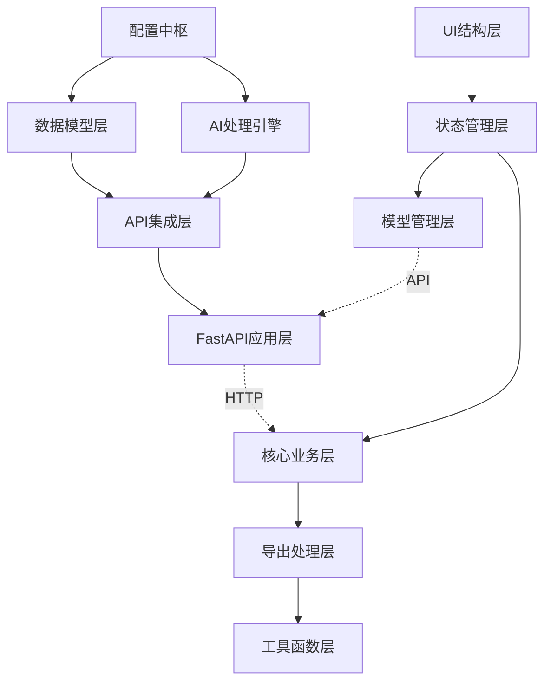

# AI Flashcard Generator 架构解剖文档

## 🔪 屠夫的精细分解

本文档以精确的解剖方式，将 AI Flashcard Generator 项目的代码结构分解为功能明确的"部位"，确保每个模块的边界清晰，便于后期功能添加时精准定位。

---

## 🏗️ 整体架构概览

```
📦 AI Flashcard Generator MVP
├── 🧠 后端大脑 (main.py)
│   ├── 🔧 配置中枢
│   ├── 📊 数据模型层
│   ├── 🤖 AI处理引擎
│   ├── 🌐 API服务层
│   └── 🛡️ 错误处理系统
├── 🎨 前端界面 (index.html / local_index.html)
│   ├── 🖼️ UI结构层
│   ├── 🎭 样式装饰层
│   ├── ⚙️ 交互逻辑层
│   ├── 📦 状态管理层
│   ├── 🔄 数据传输层
│   └── 📤 导出处理层
└── 📚 依赖支撑 (requirements.txt)
```

---

## 🧠 后端解剖 (main.py)

### 📍 第一部位：导入和依赖管理
**位置**: `main.py:1-8`
**功能**: 外部库导入和基础设置
```python
# 解剖代码位置
from fastapi import FastAPI, HTTPException
from pydantic import BaseModel
import httpx, logging, re
```

**职责分工**:
- `FastAPI`: Web框架核心
- `pydantic`: 数据验证和序列化
- `httpx`: 异步HTTP客户端
- `logging`: 日志记录
- `re`: 正则表达式处理

**扩展位点**: 新增依赖在此处添加

---

### 📍 第二部位：配置中枢系统
**位置**: `main.py:9-119`
**功能**: 全局配置和常量定义

#### 🎯 子模块 2.1: Prompt 配置核心
**位置**: `main.py:11-47`
```python
SYSTEM_PROMPT = """..."""  # 核心Prompt模板
```
**特征**:
- 硬编码的Prompt逻辑
- 10张卡片限制 (第28行)
- 中文专用规则集

**改进靶点**: 未来Prompt模板系统的替换位置

#### 🎯 子模块 2.2: 模型配置仓库
**位置**: `main.py:49-104`
```python
SUPPORTED_MODELS = {...}  # 模型配置字典
DEFAULT_MODEL_ID = "google/gemini-2.5-flash-preview"
```
**数据结构**:
```python
{
    "model_id": {
        "name": str,
        "description": str, 
        "max_tokens": int,
        "suggested_use": str
    }
}
```

#### 🎯 子模块 2.3: 错误映射表
**位置**: `main.py:110-119`
```python
OPENROUTER_ERROR_MAP = {...}  # HTTP错误码映射
```
**功能**: OpenRouter API错误码到用户友好消息的转换

---

### 📍 第三部位：数据模型层
**位置**: `main.py:121-133`
**功能**: API数据结构定义

#### 🎯 子模块 3.1: 请求模型
```python
class FlashcardRequest(BaseModel):
    text: str           # 输入文本
    api_key: str        # API密钥
    model_name: str     # 模型选择
```

#### 🎯 子模块 3.2: 卡片数据模型
```python
class FlashcardPair(BaseModel):
    q: str  # 问题
    a: str  # 答案
```

#### 🎯 子模块 3.3: 响应模型
```python
class FlashcardResponse(BaseModel):
    flashcards: list[FlashcardPair]
    error: str | None = None
```

**扩展位点**: 新增字段在对应模型类中添加

---

### 📍 第四部位：AI处理引擎
**位置**: `main.py:135-236`
**功能**: LLM输出解析和处理

#### 🎯 子模块 4.1: 解析状态机
**位置**: `main.py:141-236`
```python
def parse_llm_output(llm_output: str) -> list[FlashcardPair]:
```
**核心逻辑**:
1. **正则模式定义** (145-146行)
2. **文本分割** (150行) - 按"---"分割
3. **状态机处理** (164-226行)
   - `finding_q`: 寻找问题状态
   - `finding_a`: 寻找答案状态  
   - `collecting_a`: 收集答案状态

**状态转换图**:
```
finding_q → finding_a → collecting_a
    ↑           ↓           ↓
    └───────────┴───────────┘
```

**容错特性**:
- 支持 Q:/q:/Q：等变体
- 处理多行答案
- 过滤空卡片

---

### 📍 第五部位：API集成层
**位置**: `main.py:238-339`
**功能**: OpenRouter API调用封装

#### 🎯 子模块 5.1: API调用核心
```python
async def generate_flashcards_from_llm(
    text_to_process: str,
    user_api_key: str, 
    model_name: str
) -> list[FlashcardPair]:
```

**处理流程**:
1. **模型验证** (248-252行)
2. **请求构建** (255-261行)
3. **API调用** (273-283行)
4. **响应解析** (286-302行)
5. **错误处理** (304-339行)

#### 🎯 子模块 5.2: 错误处理系统
**错误类型**:
- `HTTPStatusError`: API状态错误
- `RequestError`: 网络连接错误
- `Exception`: 未知错误

**处理策略**: 分层错误映射 + 用户友好提示

---

### 📍 第六部位：FastAPI应用层
**位置**: `main.py:341-412`
**功能**: Web服务框架和路由定义

#### 🎯 子模块 6.1: 应用配置
**位置**: `main.py:342-352`
```python
app = FastAPI()
app.add_middleware(CORSMiddleware, ...)
```

#### 🎯 子模块 6.2: 工具性端点
**位置**: `main.py:355-369`
```python
@app.get("/supported_models")
```
**返回结构**:
```json
{
    "default_model_id": "string",
    "models": {...}
}
```

#### 🎯 子模块 6.3: 核心业务端点
**位置**: `main.py:372-412`
```python
@app.post("/generate_flashcards/", response_model=FlashcardResponse)
```

**处理流程**:
1. **输入验证** (377-389行)
2. **业务调用** (392-397行)
3. **结果封装** (399-405行)
4. **异常处理** (407-412行)

---

## 🎨 前端解剖 (index.html / local_index.html)

### 📍 第一部位：UI结构层
**位置**: `index.html:1-419`
**功能**: HTML骨架和组件定义

#### 🎯 子模块 1.1: 输入区域
**位置**: `353-372行`
```html
<div class="input-group">
    <input type="password" id="apiKey">     <!-- API密钥输入 -->
    <textarea id="inputText">              <!-- 文本输入 -->
    <select id="modelSelect">              <!-- 模型选择 -->
</div>
```

#### 🎯 子模块 1.2: 控制区域
**位置**: `374-378行`
```html
<div class="button-group">
    <button id="generateButton">          <!-- 生成按钮 -->
    <button id="clearButton">             <!-- 清除按钮 -->
</div>
```

#### 🎯 子模块 1.3: 导出区域
**位置**: `380-406行`
```html
<div id="exportSection" class="hidden">
    <select id="exportFormatSelect">      <!-- 格式选择 -->
    <input id="deckNameInput">            <!-- Anki配置 -->
    <button id="exportActionButton">      <!-- 导出按钮 -->
</div>
```

#### 🎯 子模块 1.4: 消息系统
**位置**: `408-417行`
```html
<div id="errorMessage" class="message error">    <!-- 错误提示 -->
<div id="successMessage" class="message success"> <!-- 成功提示 -->
<div id="loadingMessage" class="message loading"> <!-- 加载提示 -->
```

#### 🎯 子模块 1.5: 结果展示
**位置**: `417行`
```html
<div id="results"></div>                 <!-- 卡片容器 -->
```

---

### 📍 第二部位：样式装饰层
**位置**: `index.html:8-347`
**功能**: CSS样式和视觉效果

#### 🎯 子模块 2.1: 基础样式系统
**位置**: `8-32行`
- 字体和布局基础
- 容器样式定义

#### 🎯 子模块 2.2: 组件样式系统
**位置**: `33-113行`
- 输入框样式
- 按钮样式
- 选择器样式

#### 🎯 子模块 2.3: 交互效果系统
**位置**: `114-346行`
- 消息样式
- 卡片样式和动画
- 悬停效果
- 删除按钮样式

---

### 📍 第三部位：状态管理层
**位置**: `index.html:420-450`
**功能**: 应用状态和数据存储

#### 🎯 子模块 3.1: 本地存储管理
```javascript
// API密钥持久化
localStorage.getItem('openRouterApiKey')
localStorage.setItem('openRouterApiKey', value)
```

#### 🎯 子模块 3.2: 消息状态管理
```javascript
function showMessage(type, messageText) {
    // 统一的消息显示逻辑
    // 支持: 'loading', 'error', 'success'
}
```

#### 🎯 子模块 3.3: 卡片数据管理
```javascript
let currentGeneratedCards = [];  // 卡片数据中心
```

---

### 📍 第四部位：模型管理层
**位置**: `index.html:452-506`
**功能**: AI模型选择和配置

#### 🎯 子模块 4.1: 模型加载器
```javascript
async function loadModels() {
    // 从后端获取模型列表
    // 动态填充选择器
}
```

#### 🎯 子模块 4.2: 模型描述管理
```javascript
function updateModelDescription() {
    // 显示模型详细信息
    // 支持动态切换
}
```

---

### 📍 第五部位：核心业务层
**位置**: `index.html:508-693`
**功能**: 卡片生成和操作逻辑

#### 🎯 子模块 5.1: 生成控制器
```javascript
async function generateFlashcards() {
    // 1. 输入验证 (517-544行)
    // 2. API调用 (557-567行)  
    // 3. 结果处理 (598-685行)
}
```

**验证链**:
```
API密钥验证 → 文本验证 → 长度验证 → 模型验证
```

#### 🎯 子模块 5.2: 卡片渲染器
**位置**: `598-676行`
```javascript
currentGeneratedCards.forEach(cardData => {
    // DOM元素创建
    // 删除按钮逻辑
    // 事件绑定
});
```

#### 🎯 子模块 5.3: 删除控制器
**位置**: `615-658行`
```javascript
deleteBtn.onclick = function(e) {
    // 确认机制
    // 动画效果
    // 数据同步
}
```

**删除流程**:
```
点击删除 → 确认状态 → 动画移除 → 数据清理
```

---

### 📍 第六部位：导出处理层
**位置**: `index.html:696-877`
**功能**: 多格式导出功能

#### 🎯 子模块 6.1: 格式控制器
```javascript
function handleFormatChange() {
    // 根据选择显示/隐藏配置选项
}
```

#### 🎯 子模块 6.2: 格式化引擎
**位置**: `735-780行`
```javascript
// 四种格式化器
formatAnkiMarkdown(cards, deck, tags)  // Anki Markdown
formatAnkiTab(cards)                   // 制表符分隔
formatCsv(cards)                       // CSV格式
formatJson(cards)                      // JSON格式
```

#### 🎯 子模块 6.3: 导出执行器
```javascript
async function performExport() {
    // 剪贴板复制
}

function performDownload() {
    // 文件下载
}
```

---

### 📍 第七部位：工具函数层
**位置**: `index.html:904-963`
**功能**: 验证和辅助功能

#### 🎯 子模块 7.1: 验证器集合
```javascript
validateApiKey(apiKey)              // API密钥格式验证
validateInputLength(text, min, max) // 文本长度验证
escapeHtml(text)                   // HTML转义
```

#### 🎯 子模块 7.2: 清理器
```javascript
function clearInputs() {
    // 重置所有输入状态
    // 隐藏导出选项
    // 清空结果区域
}
```

---

## 🔗 模块间依赖关系图



---

## 🎯 功能扩展位点指南

### 添加新的Prompt模板
**目标位置**: `main.py:11-47` (配置中枢)
**扩展方式**: 
1. 替换硬编码SYSTEM_PROMPT为模板系统
2. 在`FlashcardRequest`添加模板选择字段

### 添加新的导出格式
**目标位置**: `index.html:735-780` (格式化引擎)
**扩展方式**:
1. 添加新的`formatXXX()`函数
2. 在`getFormattedText()`的switch语句中添加case
3. 在HTML的`exportFormatSelect`添加选项

### 添加数据持久化
**后端位置**: `main.py:121-133` (数据模型层)
**前端位置**: `index.html:508-693` (核心业务层)  
**扩展方式**:
1. 添加数据库模型
2. 创建CRUD API端点
3. 修改前端状态管理

### 添加用户认证
**后端位置**: `main.py:341-352` (FastAPI应用层)
**前端位置**: `index.html:420-450` (状态管理层)
**扩展方式**:
1. 添加认证中间件
2. 扩展用户相关API端点
3. 添加登录/注册界面

### 添加新的AI模型
**目标位置**: `main.py:49-104` (模型配置仓库)
**扩展方式**: 在`SUPPORTED_MODELS`字典中添加新条目

---

## 🛠️ 代码定位快速索引

| 功能需求 | 文件位置 | 行数范围 | 关键标识 |
|---------|---------|---------|---------|
| 修改Prompt逻辑 | main.py | 11-47 | `SYSTEM_PROMPT` |
| 添加新模型 | main.py | 49-104 | `SUPPORTED_MODELS` |
| 修改解析逻辑 | main.py | 141-236 | `parse_llm_output` |
| 添加API端点 | main.py | 341-412 | `@app.` |
| 修改UI布局 | index.html | 1-419 | HTML结构 |
| 添加样式 | index.html | 8-347 | CSS规则 |
| 修改生成逻辑 | index.html | 508-693 | `generateFlashcards` |
| 添加导出格式 | index.html | 735-780 | `format***` |
| 添加验证规则 | index.html | 904-963 | `validate***` |

---

## 📚 扩展最佳实践

### 1. 保持模块边界清晰
- 新功能应遵循现有的模块划分
- 避免跨模块的紧耦合

### 2. 遵循命名约定
- 后端：snake_case
- 前端：camelCase  
- 配置：UPPER_CASE

### 3. 错误处理一致性
- 后端：使用HTTPException
- 前端：使用showMessage统一显示

### 4. 数据流向原则
- 前端 → 后端：通过API端点
- 后端 → 前端：JSON响应
- 状态管理：单向数据流

---

**文档版本**: v1.0  
**创建日期**: 2025-06-20  
**维护说明**: 代码结构变更时需同步更新此文档