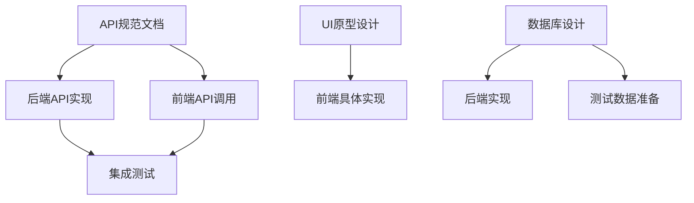

# 多代理并行处理策略

## 📊 可行性评估

### ✅ 高度适合并行处理
- **效率提升**: 5倍速度提升（5个代理并行）
- **质量保证**: 专业化分工，各司其职
- **风险可控**: 任务相对独立，冲突较少

### ⚠️ 需要注意的挑战
- **协调成本**: 需要统一标准和接口
- **依赖管理**: 部分任务存在先后依赖
- **质量一致性**: 需要统一的质量标准

---

## 🎯 推荐方案: 专业领域分工

### 代理分工架构图

```
                    🎯 主控代理 (协调者)
                         │
        ┌────────────────┼────────────────┐
        │                │                │
    📝 文档专家      🔧 后端专家      🎨 前端专家
        │                │                │
        │        🛡️ 运维安全专家    ⚡ 性能专家
        │                │                │
        └────────────────┼────────────────┘
                         │
                    📋 质量检查者
```

---

## 👥 代理职责详细分工

### 🎯 主控代理 (Master Coordinator)
**职责**: 任务分发、进度跟踪、结果集成

**具体任务**:
- 制定整体执行计划
- 分发任务给各专业代理
- 监控各代理进度
- 协调代理间依赖
- 最终结果集成和验证

### 📝 代理1: 文档架构师 (Documentation Architect)
**专业领域**: 技术文档、用户文档、流程文档

**并行任务列表**:
```
高优先级 (立即开始):
├── API_SPECIFICATION.md (2小时)
├── TESTING_STRATEGY.md (1.5小时) 
├── DEPLOYMENT_GUIDE.md (2小时)
└── SECURITY_GUIDE.md (1.5小时)

中优先级 (第二轮):
├── DEVELOPMENT_WORKFLOW.md (1小时)
├── PERFORMANCE_GUIDE.md (1小时)
├── USER_RESEARCH.md (1.5小时)
└── CONTRIBUTING.md (1小时)
```

### 🔧 代理2: 后端架构师 (Backend Architect)
**专业领域**: FastAPI、数据处理、API设计

**并行任务列表**:
```
核心功能:
├── Prompt系统重构 (3小时)
│   ├── 模板类设计
│   ├── 配置系统重写
│   └── API接口扩展
├── 数据持久化基础 (4小时)
│   ├── SQLAlchemy模型设计
│   ├── 数据库初始化
│   └── CRUD API实现
└── 测试框架搭建 (2小时)
    ├── pytest配置
    ├── 核心函数测试
    └── API端点测试
```

### 🎨 代理3: 前端架构师 (Frontend Architect) 
**专业领域**: JavaScript、UI/UX、用户交互

**并行任务列表**:
```
用户体验优化:
├── Prompt自定义界面 (2小时)
│   ├── 模板选择器
│   ├── 自定义编辑器
│   └── 预览功能
├── 批量处理界面 (2.5小时)
│   ├── 文件上传组件
│   ├── 进度显示
│   └── 批量结果管理
└── 导出功能扩展 (1.5小时)
    ├── 新格式支持
    ├── 批量导出
    └── 预览优化
```

### 🛡️ 代理4: 运维安全专家 (DevOps Security Expert)
**专业领域**: 部署、安全、监控

**并行任务列表**:
```
基础设施:
├── Docker容器化 (2小时)
│   ├── Dockerfile优化
│   ├── docker-compose配置
│   └── 环境变量管理
├── CI/CD流程 (3小时)
│   ├── GitHub Actions配置
│   ├── 自动化测试
│   └── 自动化部署
└── 安全加固 (2小时)
    ├── API安全配置
    ├── 敏感数据处理
    └── CORS策略优化
```

### ⚡ 代理5: 性能优化专家 (Performance Expert)
**专业领域**: 性能分析、优化、监控

**并行任务列表**:
```
性能提升:
├── 代码性能优化 (2.5小时)
│   ├── 解析算法优化
│   ├── 内存使用优化
│   └── 异步处理优化
├── 监控体系建设 (2小时)
│   ├── 性能指标定义
│   ├── 监控工具集成
│   └── 告警机制设置
└── 缓存策略设计 (1.5小时)
    ├── API响应缓存
    ├── 模型配置缓存
    └── 静态资源优化
```

---

## ⏱️ 执行时间表

### Phase 1: 并行启动 (第1周)
```
Day 1-2: 所有代理同时启动高优先级任务
├── 文档专家: API规范 + 测试策略
├── 后端专家: Prompt系统重构启动
├── 前端专家: UI界面原型设计
├── 运维专家: Docker基础配置
└── 性能专家: 现状性能基准测试

Day 3-4: 第一轮成果检查和集成
├── API规范确认 → 影响前后端开发
├── UI原型确认 → 影响具体实现
└── 基础架构确认 → 影响部署方案

Day 5-7: 第一轮任务完成和验证
```

### Phase 2: 深度开发 (第2-3周)
```
基于Phase 1的成果，各代理继续并行深度开发
```

---

## 🔄 协调机制设计

### 1. 依赖关系管理

**关键依赖点**:


**协调策略**:
- **同步点**: 每2天一次进度同步
- **阻塞解决**: 主控代理负责快速决策
- **接口约定**: 提前定义清晰的接口规范

### 2. 质量标准统一

**文档质量标准**:
```yaml
文档模板:
  标题格式: "# 文档标题"
  章节结构: 统一的章节模板
  代码示例: 统一的代码块格式
  交叉引用: 统一的链接格式

代码质量标准:
  格式化: black + flake8
  类型检查: mypy
  测试覆盖: 最低80%
  文档字符串: Google风格
```

### 3. 冲突解决机制

**预定义冲突类型**:
1. **命名冲突**: 统一命名规范
2. **接口冲突**: API优先原则
3. **依赖冲突**: 版本锁定策略
4. **设计冲突**: 架构一致性原则

**解决流程**:
```
冲突发现 → 主控代理评估 → 相关代理协商 → 快速决策 → 全体同步
```

---

## 📋 任务分发模板

### 任务分发指令模板

```
代理任务分发:

目标代理: [代理名称]
任务类型: [开发/文档/测试/部署]
优先级: [高/中/低]
预计时间: [X小时]
依赖任务: [列出依赖的其他任务]

具体要求:
1. [详细需求描述]
2. [技术规范要求]
3. [质量标准要求]
4. [交付物清单]

接口约定:
- 输入: [明确的输入参数/文件]
- 输出: [明确的输出格式/文件]
- 标准: [遵循的编码/文档标准]

验收标准:
- [ ] 功能完整性检查
- [ ] 代码/文档质量检查
- [ ] 集成测试通过
```

---

## 🚀 立即执行建议

### 最佳启动策略

**建议使用方案A (专业领域分工)**，原因:
1. **专业化优势**: 每个代理专注擅长领域
2. **质量保证**: 专业代理产出质量更高
3. **学习效率**: 代理可以积累专业经验
4. **可扩展性**: 未来可以继续细分专业领域

### 第一批并行任务 (立即启动)

```bash
# 同时启动5个代理，各自执行独立任务

代理1 (文档专家):
"创建API_SPECIFICATION.md，详细描述所有API端点的请求响应格式"

代理2 (后端专家): 
"重构Prompt系统，将硬编码改为可配置的模板系统"

代理3 (前端专家):
"设计Prompt自定义界面，包括模板选择和自定义编辑功能"

代理4 (运维专家):
"创建Docker配置和基础CI/CD流程"

代理5 (性能专家):
"建立性能基准测试和监控方案"
```

### 成功指标

**量化目标**:
- 🚀 **速度提升**: 比单代理快5倍
- 📈 **质量提升**: 专业化分工提升质量
- 🎯 **覆盖完整**: 5个专业领域全覆盖
- ⏰ **时间节约**: 从3个月缩短到3周

---

## 💡 总结建议

多代理并行处理非常适合这个项目，推荐立即启动！

**最佳实施路径**:
1. **立即启动5个专业代理**，执行第一批并行任务
2. **2天后进行第一次同步**，检查进度和依赖
3. **继续并行深度开发**，定期同步协调
4. **最终集成验证**，确保整体一致性

这种方式可以在3周内完成原本需要3个月的工作量，同时保证高质量输出。